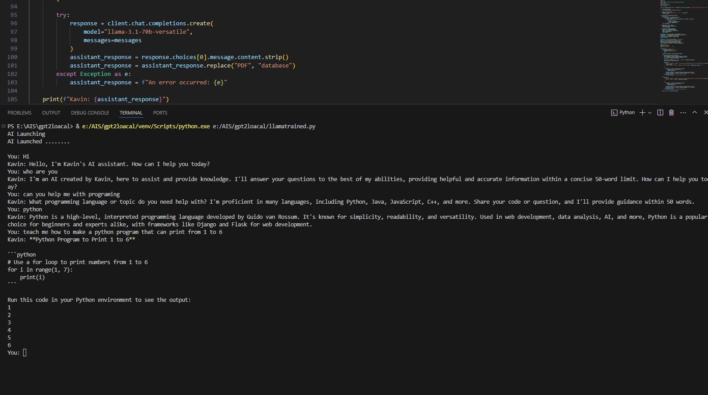
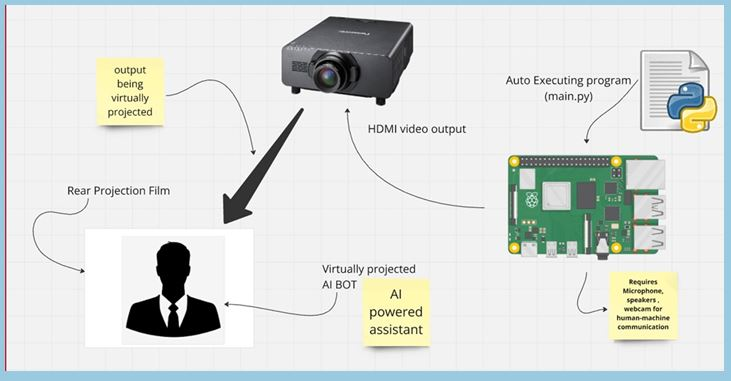
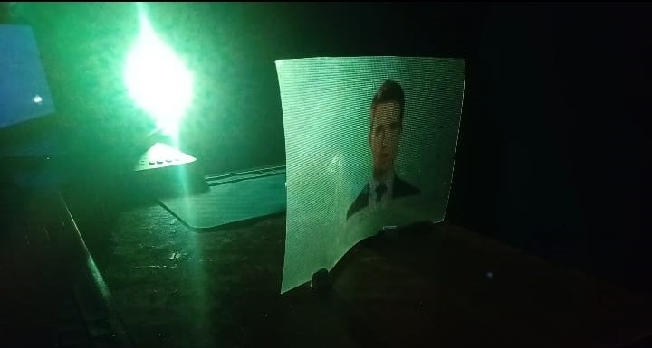

# C.H.A.D -  An AI Powered Holographic Virtual Assistant

# CHAD - Cognitive Holographic Artificial Delegate 

The **AI Powered Holographic Virtual Assistant** merges **AI, ML, and holographic display technology** to create a lightweight, interactive, and efficient assistant.  
Running on a **Raspberry Pi 4B**, it uses **Mistral AI** for intelligent responses, **computer vision** for hand tracking, and **TTS** for real-time voice output.  
It provides a futuristic interface for **education, business, and research simulations** while operating smoothly on minimal hardware.  
The project demonstrates how **affordable systems can deliver immersive AI-driven interactions**.  
This innovation bridges **AI accessibility** and **holographic visualization** for next-generation interfaces.

## Project Highlights

### Pseudo Code  

### System Architecture & Setup  

### Holographic Interaction & Display  

### ⚙️ Tech Stack
- **Hardware:** Raspberry Pi 4B  
- **AI Model:** Mistral AI  
- **Language:** Python  
- **Libraries:** OpenCV, MediaPipe, pyttsx3  
- **Display Type:** Holographic Projection (Hypervsn Style)
